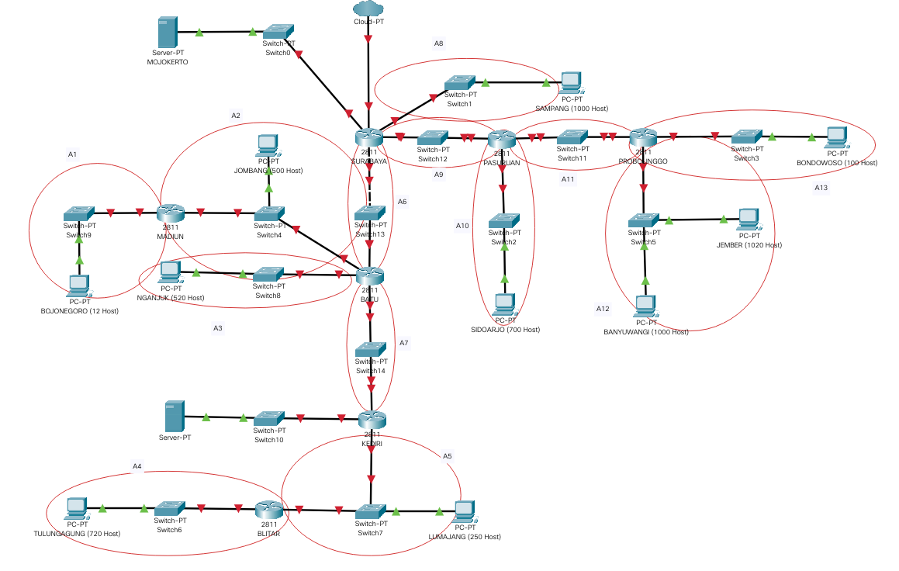
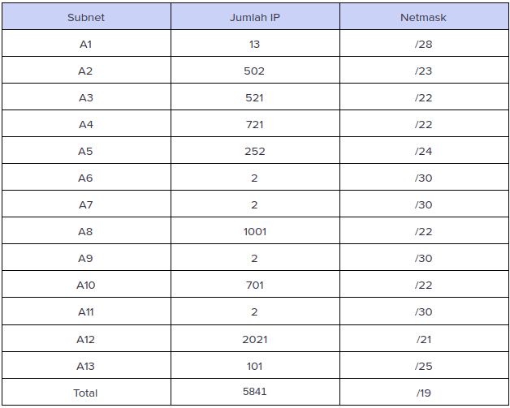
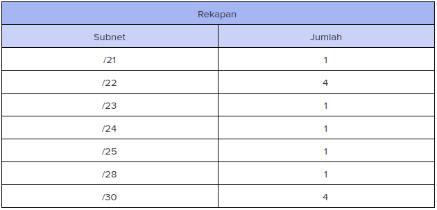
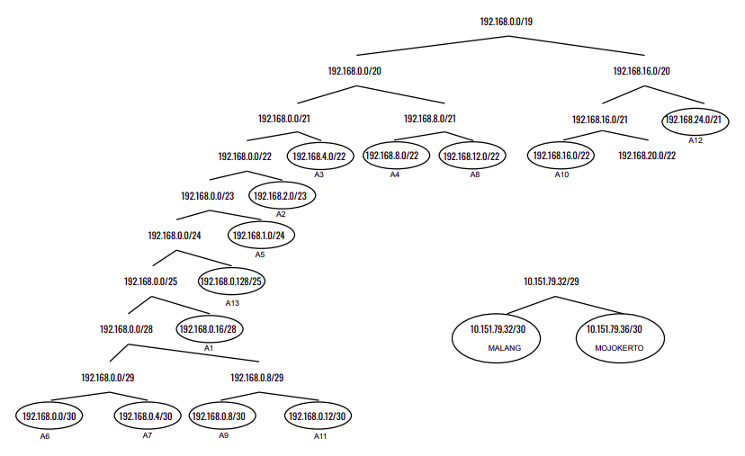
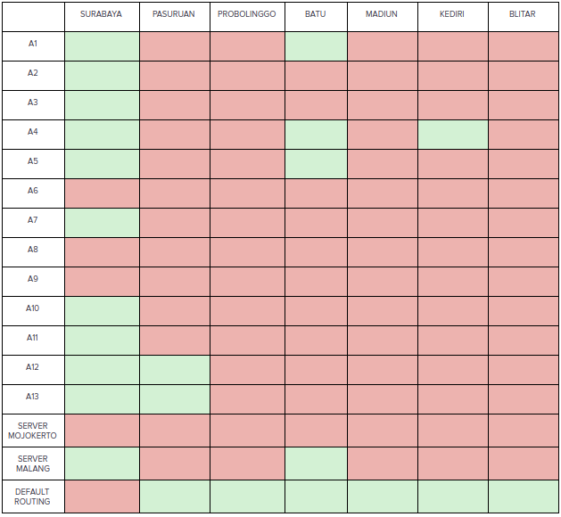
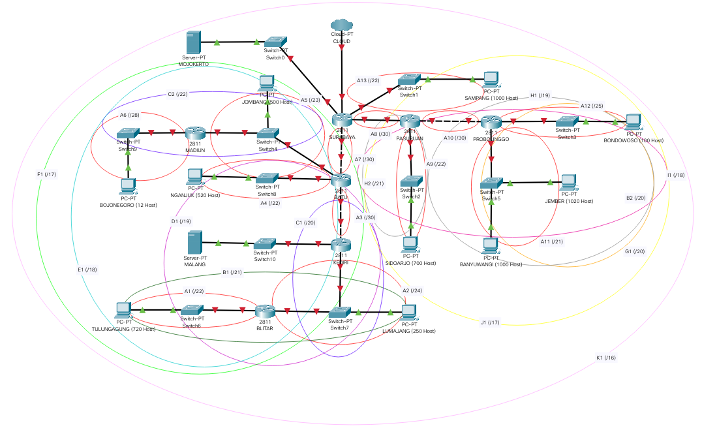
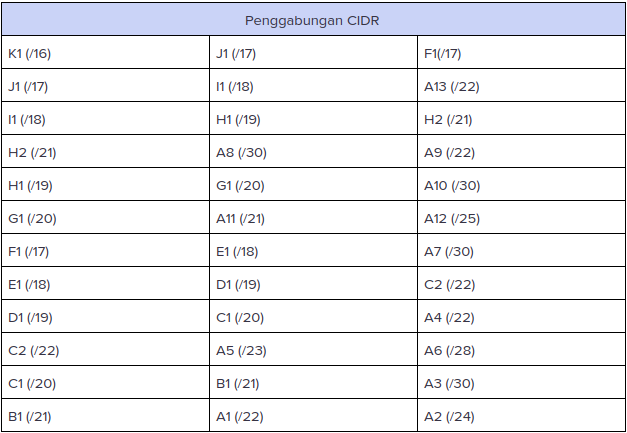
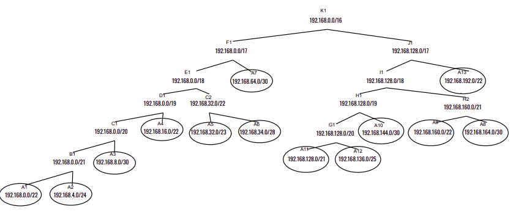
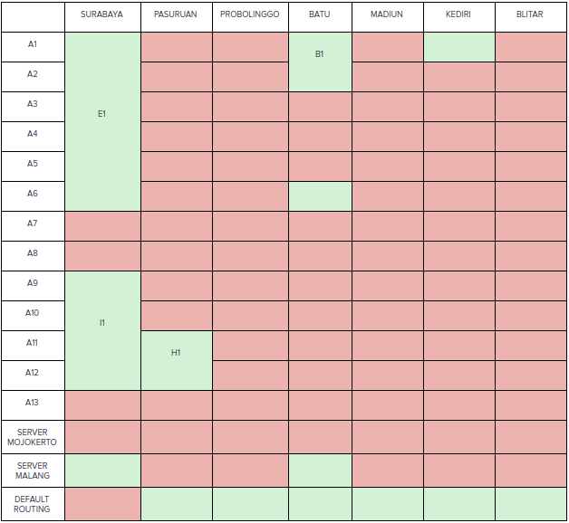

# Modul 4

 - VLSM
	 * <a href="#topologi-vlsm">Topologi</a>
	 * <a href="#netmask-vlsm">Pembagian Netmask</a>
	 * <a href="#pohon-vlsm">Pohon IP</a>
     * <a href="#routing-vlsm">Routing</a>
     * <a href="#pembagian-ip-vlsm">Pembagian IP</a>
     * <a href="#implementasi-vlsm">Implementasi</a>
 - CIDR
	 * <a href="#topologi-cidr">Topologi</a>
	 * <a href="#netmask-cidr">Pembagian Netmask</a>
	 * <a href="#pohon-cidr">Pohon IP</a>
     * <a href="#routing-cidr">Routing</a>
     * <a href="#pembagian-ip-cidr">Pembagian IP</a>
     * <a href="#implementasi-cidr">Implementasi</a>

## VLSM
<justify></justify>

Topologi pada UML beserta pembagian subnet : 

|              | Pembagian IP      |                  |
|--------------|-------------------|------------------|
| A1           | Network ID        | 192.168.0.16     |
|              | Netmask           | 255.255.255.240  |
|              | Broadcast Address | 192.168.0.31     |
| A2           | Network ID        | 192.168.2.0      |
|              | Netmask           | 255.255.254.0    |
|              | Broadcast Address | 192.168.3.255    |
| A3           | Network ID        | 192.168.4.0      |
|              | Netmask           | 255.255.252.0    |
|              | Broadcast Address | 192.168.7.255    |
| A4           | Network ID        | 192.168.8.0      |
|              | Netmask           | 255.255.252.0    |
|              | Broadcast Address | 192.168.11.255   |
| A5           | Network ID        | 192.168.1.0      |
|              | Netmask           | 255.255.255.0    |
|              | Broadcast Address | 192.168.1.255    |
| A6           | Network ID        | 192.168.0.0      |
|              | Netmask           | 255.255.255.252  |
|              | Broadcast Address | 192.168.0.3      |
| A7           | Network ID        | 192.168.0.4      |
|              | Netmask           | 255.255.255.252  |
|              | Broadcast Address | 192.168.0.7      |
| A8           | Network ID        | 192.168.12.0     |
|              | Netmask           | 255.255.252.0    |
|              | Broadcast Address | 192.168.15.255   |
| A9           | Network ID        | 192.168.0.8      |
|              | Netmask           | 255.255.255.252  |
|              | Broadcast Address | 192.168.0.11     |
| A10          | Network ID        | 192.168.16.0     |
|              | Netmask           | 255.255.252.0    |
|              | Broadcast Address | 192.168.19.255   |
| A11          | Network ID        | 192.168.0.12     |
|              | Netmask           | 255.255.255.252  |
|              | Broadcast Address | 192.168.0.15     |
| A12          | Network ID        | 192.168.24.0     |
|              | Netmask           | 255.255.248.0    |
|              | Broadcast Address | 192.168.31.255   |
| A13          | Network ID        | 192.168.0.128    |
|              | Netmask           | 255.255.255.128  |
|              | Broadcast Address | 192.168.0.255    |
| MALANG       | Network ID        | 10.151.79.32     |
|              | Netmask           | 255.255.255.252  |
|              | Broadcast Address | 10.151.79.35     |
| MOJOKERTO    | Network ID        | 10.151.79.36     |
|              | Netmask           | 255.255.255.252  |
|              | Broadcast Address | 10.151.79.39     |

### IMPLEMENTASI

Implementasi saya lakukan melalui UML

Langkah-langkah :

- buat topologi.sh  
- aktifkan iptables pada surabaya <code>iptables –t nat –A POSTROUTING –o eth0 –j MASQUERADE –s 192.168.0.0/16</code> 
- setting <code>/etc/sysctl.conf</code> uncomment pada <code>net.ipv4.ip_forward=1</code> kemudian <code>sysctl -p</code> pada masing2 router 
- setting interface pada masing2 uml 
- tambahkan route pada setiap router mengikuti topologi

Testing : 
- semua uml harus bisa <code>ping its.ac.id</code>

</justify>

## CIDR
<justify>

Topologi pada CPT beserta pembagian subnet : 

|              |   Pembagian IP    |                  |
|--------------|-------------------|------------------|
| A1           | Network ID        | 192.168.0.0      |
|              | Netmask           | 255.255.252.0    |
|              | Broadcast Address | 192.168.3.255    |
| A2           | Network ID        | 192.168.4.0      |
|              | Netmask           | 255.255.255.0    |
|              | Broadcast Address | 192.168.4.255    |
| A3           | Network ID        | 192.168.8.0      |
|              | Netmask           | 255.255.255.252  |
|              | Broadcast Address | 192.168.8.3      |
| A4           | Network ID        | 192.168.16.0     |
|              | Netmask           | 255.255.252.0    |
|              | Broadcast Address | 192.168.19.255   |
| A5           | Network ID        | 192.168.32.0     |
|              | Netmask           | 255.255.254.0    |
|              | Broadcast Address | 192.168.33.255   |
| A6           | Network ID        | 192.168.34.0     |
|              | Netmask           | 255.255.255.240  |
|              | Broadcast Address | 192.168.34.15    |
| A7           | Network ID        | 192.168.64.0     |
|              | Netmask           | 255.255.255.252  |
|              | Broadcast Address | 192.168.64.3     |
| A8           | Network ID        | 192.168.164.0    |
|              | Netmask           | 255.255.255.252  |
|              | Broadcast Address | 192.168.164.3    |
| A9           | Network ID        | 192.168.160.0    |
|              | Netmask           | 255.255.252.0    |
|              | Broadcast Address | 192.168.163.255  |
| A10          | Network ID        | 192.168.144.0    |
|              | Netmask           | 255.255.255.252  |
|              | Broadcast Address | 192.168.144.3    |
| A11          | Network ID        | 192.168.128.0    |
|              | Netmask           | 255.255.248.0    |
|              | Broadcast Address | 192.168.135.255  |
| A12          | Network ID        | 192.168.136.0    |
|              | Netmask           | 255.255.255.128  |
|              | Broadcast Address | 192.168.136.127  |
| A13          | Network ID        | 192.168.192.0    |
|              | Netmask           | 255.255.252.0    |
|              | Broadcast Address | 192.168.195.255  |
| MALANG       | Network ID        | 10.151.79.32     |
|              | Netmask           | 255.255.255.252  |
|              | Broadcast Address | 10.151.79.35     |
| MOJOKERTO    | Network ID        | 10.151.79.36     |
|              | Netmask           | 255.255.255.252  |
|              | Broadcast Address | 10.151.79.39     |

### IMPLEMENTASI

Implementasi saya lakukan melalui Cisco Packet Tracer

Langkah-langkah :

- buat topologi  
- setting interface pada semua router, server, dan client 
- tambahkan static route pada setiap router mengikuti topologi

Testing : 
- harus bisa saling ping

</justify>

## CATATAN
<justify>

Pembagian subnet CIDR kurang efisien (harusnya A8 tidak usah digabungkan sama subnet H2)

</justify>